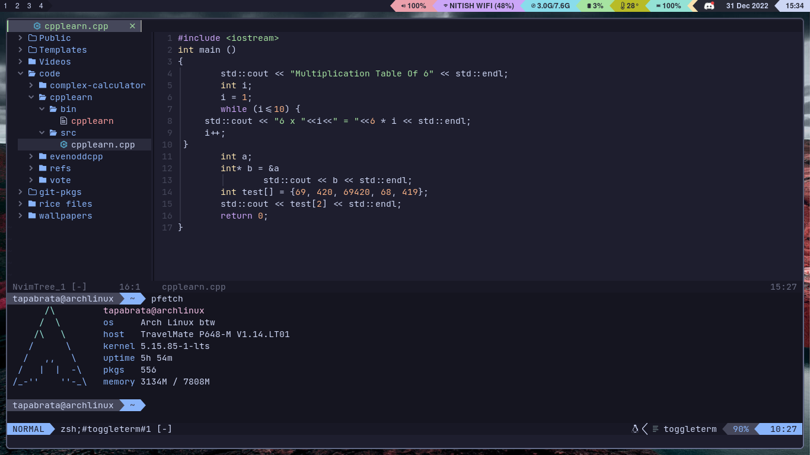

# nvim-dots
my Neovim config files 
# Preview
 
## Installation
### Requirements
- Neovim
- git
- [packer.nvim](https://github.com/wbthomason/packer.nvim)
### Commands To Install my configs (For Unix/Unix-Like Operating Systems Such As GNU/Linux and MacOS)
# MAKE SURE YOU BACKUP YOUR NEOVIM CONFIG FOLDER BEFORE YOU CONTINUE!!!!!!!!
```
git clone https://github.com/TheTapo/nvim-dots
cd nvim-dots
cp nvim ~/.config
```
### For Windows
- Clone this repository
- Go to the 'nvim-dots' folder
- Move the 'nvim' folder to %APPDATA%\local

